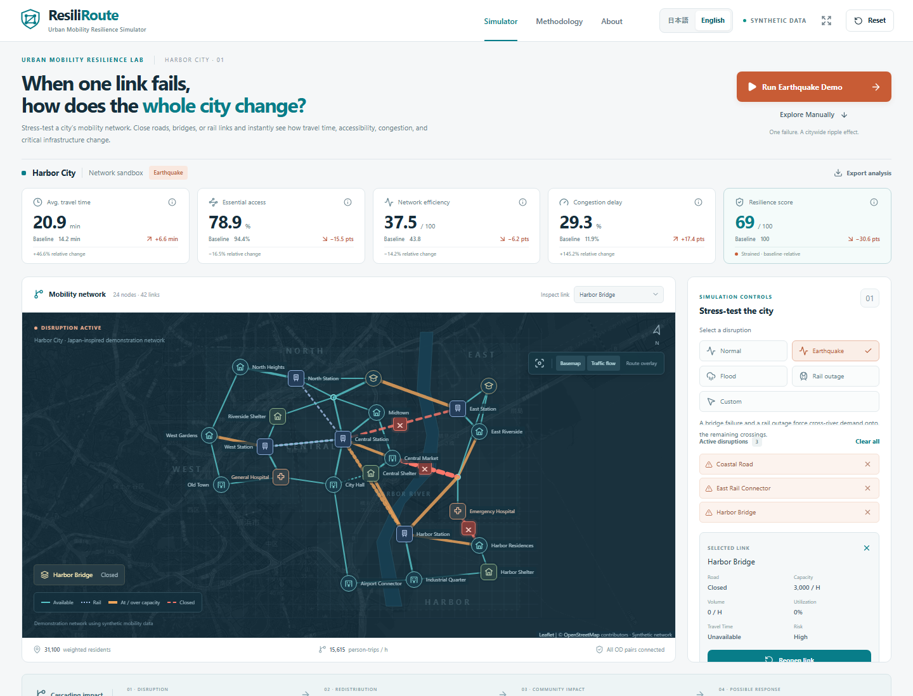
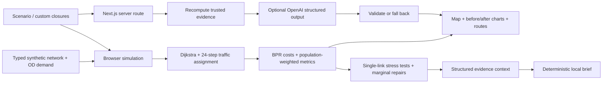

# ResiliRoute

**Urban Mobility Resilience Simulator**

_When one link fails, how does the whole city change?_

ResiliRoute is an educational civic-tech application for understanding **cascading transportation failures**. Close a bridge, road or rail link in a synthetic city. Demand redistributes, congestion changes, essential services become harder to reach, and recovery options can be compared.

This is network resilience analysis for communities, planners and students. It is not a live navigation or emergency safety system.



## Problem & solution

A local infrastructure failure can have unequal citywide consequences. A route finder shows a detour; a resilience model shows the demand moving onto other corridors and the communities losing timely hospital or shelter access.

ResiliRoute connects an interactive map, transparent graph algorithms, capacity-based traffic assignment, population-weighted metrics and an evidence-grounded planning brief. One short demo makes the chain visible: **failure → redistribution → congestion → access loss → possible recovery**.

## Key features

- Interactive Leaflet network over an OpenStreetMap basemap, with a schematic fallback if tiles fail.
- Normal, earthquake, flood, rail outage and arbitrary custom link closures.
- A seven-step earthquake demonstration with Skip and Reset.
- Dijkstra route comparison, before/after travel time, distance and link count; explicit unreachable states.
- 43 synthetic OD pairs, conserved traffic reassignment, shared link capacity and a bounded BPR congestion function.
- Five computed before/after KPIs with absolute and relative changes.
- Citywide comparison, district accessibility and interactive criticality bars.
- District travel-time, accessibility and isolation details; facility-specific hospital and shelter access.
- Scenario-dependent single-link stress testing of every available link.
- Recovery optimizer: independently reopen each closed link and rank its modeled benefit.
- Structured resilience brief with a deterministic local analyst and optional server-side OpenAI generation.
- In-app **日本語 / English** switch for controls, maps, metrics, charts, explanations and both local/LLM briefs; the browser remembers the choice.
- JSON analysis export, presentation mode, keyboard link selection, reduced-motion support, explanatory tooltips and a detailed Methodology dialog.

## First-minute demo

1. Open the app. The normal city is the reference. Choose **English** in the header for an international demo, or **日本語** for your own checks.
2. Click **Run Earthquake Demo**. The roughly six-second sequence closes Harbor Bridge, East Rail Connector and Coastal Road.
3. Inspect the red dashed closures and thicker over-capacity corridors. Enable **Route overlay** to compare East Riverside → General Hospital.
4. Scroll to the district analysis, stress-test ranking and Recovery Optimizer.
5. Read the AI Resilience Brief, then click **Restore Harbor Bridge**. The result improves because the model is rerun.
6. Click **Reset** to return exactly to the reference network.

Computed values for the included dataset, rounded for display:

| Indicator                           |     Normal | Earthquake |
| ----------------------------------- | ---------: | ---------: |
| Demand-weighted average travel time |   14.2 min |   20.9 min |
| Essential-service accessibility     |      94.4% |      78.9% |
| Network efficiency index            | 43.8 / 100 | 37.5 / 100 |
| Congestion delay above free flow    |      11.9% |      29.3% |
| Baseline-relative resilience        |  100 / 100 |   69 / 100 |
| Disconnected OD pairs               |          0 |          0 |

All OD pairs remain connected in this earthquake scenario, yet access falls. East district’s average modeled trip grows from **14.8 to 29.2 minutes**. Independently restoring Harbor Bridge adds **16.2 resilience points** and **6.5 accessibility points**. The post-earthquake next-failure ranking starts with **Harbor Rail**, illustrating how criticality changes after other links disappear. These values are calculated from the dataset; they are not UI constants.

## Technical architecture

The language switch preserves closures, selected links, routes, KPIs and running demo progress. English is the initial language; the selection is stored locally in the browser. If storage is disabled, switching still works for the current session. Reset clears the scenario, not the language. The AI request includes a validated `en`/`ja` language; its cache is separated by language and its local fallback uses the same evidence in the selected language. Exported JSON retains stable English field names and network IDs, records the selected language and includes the localized brief. OpenStreetMap's external tile labels follow the map provider's data, while ResiliRoute's own network labels switch languages.

Next.js 16 App Router, React 19, strict TypeScript, Tailwind CSS 4 with a custom design system, React-Leaflet 5 / Leaflet 1.9, Recharts 3, Lucide, Vitest and Playwright. No login, database or external mobility data API is required.



The core calculations are pure functions in `lib/`, separate from React. The server accepts validated scenario/closure IDs and a supported display language; it recomputes the model rather than accepting user-supplied metrics. Leaflet is loaded on the client to avoid server-side browser API errors.

```text
app/                 Page, metadata, error boundaries, AI route, global styles
components/          Map, controls, dashboard, charts, AI brief and dialogs
data/                Harbor City network, OD demand, scenarios, model settings
lib/graph/           Compiled adjacency graph and Dijkstra
lib/simulation/      Congestion, successive-average assignment, stress/recovery tests
lib/metrics/         Accessibility, efficiency, district and resilience calculations
lib/ai/              Evidence context, local analysis, schema and server provider
lib/i18n/            Japanese messages, display-name translations and locale validation
types/               Strict network, simulation and analysis interfaces
tests/               Unit/data audits and desktop/mobile browser tests
docs/screenshots/    Product screenshots for README and submission
```

## Algorithms & explainability

**Routing.** Dijkstra minimizes nonnegative generalized cost, here modeled travel time. Closed edges are removed. Bidirectional links share capacity across both directions. The implementation is O(V² + E), appropriate for this 24-node network, and accepts an arbitrary edge-weight function.

**Traffic demand.** Residential OD demand is synthetic population × origin demand weight × destination-purpose factor × destination attraction. Additional station-to-commerce pairs model onward demand. Units are person-trips per model hour, not vehicles or observed traffic counts.

**Assignment.** Twenty-four iterations of method-of-successive-averages assignment find current least-cost OD paths, average route flows and update link times. Demand is conserved across the route-flow mixture; unreachable trips are tracked separately. The final Route Explorer shows the least-cost path at the final link costs. Fixed iterations do not certify equilibrium convergence.

**Congestion.** `t = t0 × [1 + 0.15 × min(v/c, 2.5)^4]`. Actual displayed utilization is uncapped. Congestion delay = extra assigned person-minutes / assigned free-flow person-minutes × 100. A change from 11.9% to 29.3% is **+17.4 percentage points**, not a 17.4% relative increase.

**Average travel time.** Sum of assigned route-flow time × flow / total demand. Disconnected OD trips receive a stated 60-minute penalty, preventing misleading improvements when trips become impossible.

**Accessibility.** Each residential population receives three equally weighted binary category scores: at least one hospital within 20 minutes, shelter within 15 minutes, and station within 12 minutes. Citywide accessibility is the population-weighted average of those scores. Facility-specific access tests that exact hospital or shelter.

**Network efficiency.** `100 × Σ demand × [10 / (10 + final shortest travel time)] / Σ demand`. Unreachable pairs contribute zero. This is an absolute harmonic index, so normal efficiency is not artificially set to 100.

**Criticality.** Remove each currently available link separately and rerun the full assignment. Combine adverse impacts: `100 × [0.35 × ΔT/T + 0.35 × ΔA/A + 0.20 × ΔE/E + 0.10 × ΔdisconnectedDemand/totalDemand]`. Each term is clamped to [0,1]; denominators have a 1-unit numerical guard. Comparisons use the **current** scenario. Scores are impact indices, not probabilities or relative-to-the-best ranks.

**Resilience.** Let a = accessibility retention, e = efficiency retention, t = baseline/current travel time, d = connected-demand retention, each clamped to [0,1]. `R = 100 × [0.35a² + 0.25e² + 0.25t²d² + 0.15d²]`. Squaring penalizes simultaneous degradation. These weights are educational modeling choices. The normal city scores 100 by definition. Bands: Resilient ≥80; Strained ≥60; Vulnerable ≥40; Critical <40.

**Districts.** Residential-origin demand gives district travel time and isolated-demand share. Most affected = largest positive travel-time change (%) + positive accessibility loss (points) + isolation share (%).

**Recovery.** Reopen each closed link independently, rerun the model and rank its resilience improvement. These are marginal repairs relative to the same current scenario, not a globally optimized repair sequence. Small or negative improvements can occur in a capacity-constrained approximate assignment; the UI reports calculated values.

All parameters are centralized in `data/harbor-city.ts`. The Methodology dialog presents the same definitions.

## Installation & local development

Use Node.js **22 or newer**. pnpm is the repository’s package manager and its lockfile is included.

```bash
npm install -g pnpm@11.25.0
pnpm install
pnpm dev
```

Open **http://127.0.0.1:3000**. With a regular npm installation, `npm install` and `npm run dev` also work; use one package manager consistently. Do not mix generated lockfiles in a contribution.

The bundled Codex environment may expose pnpm by an absolute runtime path rather than `npm` on PATH. This repository does not depend on that machine-specific path.

On Windows, `./scripts/dev.ps1` also locates an installed pnpm/npm or the bundled Codex pnpm runtime and starts the app. It does not change system settings.

## Environment variables & AI integration

The application works completely without an API key. To enable optional LLM prose, copy `.env.example` to `.env.local`:

```dotenv
OPENAI_API_KEY=your_server_side_key
OPENAI_MODEL=gpt-4.1-mini
```

- **No key:** the computed local analysis is immediately available and the API returns the same deterministic structured brief. The interface labels it **Evidence-based local analysis**. This is a rules-based analyst, not an LLM.
- **With a key:** the server uses the [OpenAI Responses API and Structured Outputs](https://developers.openai.com/api/docs/guides/structured-outputs?api-mode=responses). The supplied JSON contains metrics, closures, district impact, facility access, redistributed flow, criticality and best recovery.
- **Failure:** a 10-second timeout, non-success response, invalid schema or suspicious output selects the local brief automatically.
- **Grounding:** the prompt requires using only supplied evidence and possible planning strategies. LLM prose cannot contain numeric claims; numbers remain in independently calculated evidence cards. This guard reduces numerical hallucinations but does not prove every qualitative claim.
- **Secrets:** the key is read only in the server route. Never prefix it with `NEXT_PUBLIC_`, include it in exports, or commit `.env.local`.
- **Cost controls:** in-flight deduplication, a 64-entry five-minute scenario cache and at most 12 upstream calls per minute per server process. A distributed public deployment needs a shared limiter and an account-level spending cap.

No paid upstream request is necessary for the demo. Provider tests mock OpenAI responses; a live model call requires your configured key and is not claimed as verified by those tests.

## Testing & building

```bash
pnpm lint
pnpm format:check
pnpm typecheck
pnpm test
pnpm analyze:data
pnpm exec playwright install chromium
pnpm test:e2e
pnpm build
pnpm start
```

Unit tests cover shortest paths, closures, invalid/one-way routing, unreachable nodes, demand conservation, BPR bounds, accessibility loss, score bounds, changing stress-test rankings, recovery, reset, dataset integrity and AI fallback/output validation. Browser tests run on desktop and mobile Chromium, covering demo, custom closures, route overlays, scenarios, analysis, dialogs, export, basemap failure, isolation, API validation, Skip and timer cancellation. The browser test command can start its own development server or reuse port 3000.

`pnpm build` creates the production Next.js application. Use `pnpm start` for recording to avoid development overlays.

To test an already running production server, set `RESILIROUTE_URL` to its URL before `pnpm test:e2e`; this skips automatic dev-server startup. The screenshot command accepts the same variable. On PowerShell: `$env:RESILIROUTE_URL='http://127.0.0.1:3001'`. Local verification passed **28 unit tests**, including four publication-privacy checks. The last production browser verification passed **20 desktop/mobile E2E checks**. See [QA report](QA_REPORT.md) for scope and unverified external services.

## Deployment

Deploy as a normal **Next.js server application**, for example using [Next.js on Vercel](https://vercel.com/docs/frameworks/full-stack/nextjs):

1. Push this repository to your own GitHub account.
2. Import the repository in Vercel and select the detected Next.js framework.
3. Use Node.js 22+, `pnpm install --frozen-lockfile` and `pnpm build`.
4. Optional: set `OPENAI_API_KEY` and `OPENAI_MODEL` as **server environment variables**.
5. Deploy, then run the earthquake flow on the deployed URL.

It is also compatible with a Node server running `pnpm build` followed by `pnpm start`. Static-only export would remove the server AI route and is not this project’s deployment configuration. Deployment requires your hosting account; no public deployment or GitHub upload is implied by a successful local build.

## Publishing safely

Use your GitHub `users.noreply.github.com` address for **both author and committer**, and enable GitHub's email privacy and email-exposure push protection. Configure this repository locally before committing:

```bash
git config user.name YOUR_GITHUB_USERNAME
git config user.email YOUR_GITHUB_NOREPLY_ADDRESS
git config core.hooksPath .githooks
pnpm check:public
```

The optional pre-push hook inspects each pushed tip, its reachable file history and author/committer metadata. `pnpm check:public` checks staged files and HEAD history. The scanner blocks recognized credential formats, personal email addresses, Windows user-profile paths, nonempty API-key templates, private files and internal preparation notes. It reports only file locations and rule names; it never prints matched values. Hooks are local and must be configured in each clone. Pattern checks cannot recognize every secret or private image: review diffs and screenshots before publishing. Keep `.env` files, keys and internal notes local; only empty environment templates belong in Git. If anything sensitive was already published, removing the current file alone does not remove historical copies.

## Data & assumptions

Harbor City has 24 nodes, 42 links, five residential districts and 43 OD pairs. Its river, coastal district, rail dependency, bridges, hospitals and shelters are inspired by Japanese urban networks. Names, infrastructure, population, capacity, demand and disruption sets are **fictional**. Coordinates and schematic geometry are not a surveyed real-city dataset. Distance uses straight-line coordinate distance × 1.2 as a synthetic path-length approximation.

OpenStreetMap tiles supply background context and attribution. The app’s synthetic network and schematic geometry remain usable when external tiles fail. Do not bulk-download or redistribute OSM tiles; use an appropriate tile provider for substantial public traffic.

## Limitations & future work

Educational decision-support prototype; not official emergency guidance. No real-time traffic, earthquake prediction, damage probabilities, physical route safety, dynamic queues, signal control, explicit mode choice or transfer penalties. The congestion curve is applied uniformly to all modeled modes. Threshold-based access is sensitive to the stated thresholds. Demand is static; isolated trips are not rescheduled.

Future work: validated local network imports, richer service thresholds, uncertainty/sensitivity analysis, calibrated multimodal assignment, verified demand/capacity data and multi-link recovery budgets. These are research directions, not features represented as implemented.

## ImpactHack 2026 submission

Built as a solo student project with AI support for design, coding, debugging, testing and documentation. The product’s analyst layer turns reproducible model evidence into a human-readable planning brief. Its distinctive focus is **cascading impact and unequal access**, with a measurable recovery comparison.

- [Devpost narrative](DEVPOST.md)
- [Three-minute screen-by-screen demo](DEMO_SCRIPT.md)
- [Official 3:50 bilingual product film and editable video sources](video/README.md)
- [Screenshot capture guide](SCREENSHOTS.md)
- [Final local verification](QA_REPORT.md)

Released under the [MIT license](LICENSE). Third-party dependencies retain their own licenses; OpenStreetMap attribution remains visible in the app and product captures.
